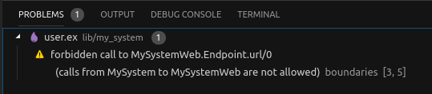
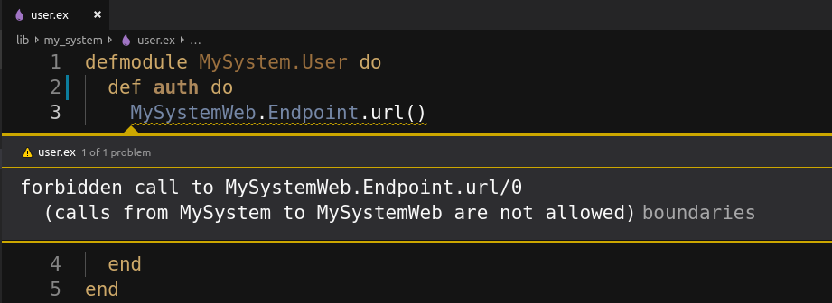

# Boundary

[](https://hex.pm/packages/boundary)
[](https://hexdocs.pm/boundary/)


Boundary is a library which helps managing and restraining cross-module dependencies in Elixir projects. A few examples of the things you can do with boundary include:

- Prevent invocations from the context layer to the web layer
- Prevent invocations from the web layer to internal context modules
- Prevent usage of Phoenix and Plug in the context layer
- Limit usage of Ecto in the web layer to only Ecto.Changeset
- Allow `:mix` modules to be used only at compile time

## Status

This library has been used in smaller production projects for about a year, and while it has not been tested on larger projects or umbrella projects, no issues are expected in those cases. That being said, if you do run into problems, please open an issue!

## Documentation

For a detailed reference see docs for [Boundary module](https://hexdocs.pm/boundary/Boundary.html) and [mix compiler](https://hexdocs.pm/boundary/Mix.Tasks.Compile.Boundary.html).

## Basic usage

To use this library, you first need to define the boundaries of your project. A __boundary__ is a named group of one or more modules. Each boundary exports some (but not all!) of its modules, and can depend on other boundaries. During compilation, the boundary compiler will find and report all cross-module function calls which are not permitted according to the boundary configuration.

### Example

Add boundary as a dependency in mix.exs:

```elixir
defmodule MySystem.MixProject do
  use Mix.Project

  # ...

  defp deps do
    [
      {:boundary, "~> 0.10", runtime: false},
      # ...
    ]
  end

  # ...
end
```

The following code defines boundaries for a typical Phoenix based project generated with `mix phx.new`.

```elixir
defmodule MySystem do
  use Boundary, deps: [], exports: []
  # ...
end

defmodule MySystemWeb do
  use Boundary, deps: [MySystem], exports: [Endpoint]
  # ...
end

defmodule MySystem.Application do
  use Boundary, top_level?: true, deps: [MySystem, MySystemWeb]
  # ...
end
```

The configuration above defines three boundaries: `MySystem`, `MySystemWeb`, and `MySystem.Application`.

Boundary modules are determined automatically from the boundary name. For example, the `MySystem` boundary contains the `MySystem` module, as well as any module whose name starts with `MySystem.` (e.g. `MySystem.User`, `MySystem.User.Schema`, ...).

The configuration specifies the following rules:

  - Modules residing in the `MySystemWeb` boundary are allowed to invoke functions from modules exported by the `MySystem` boundary.
  - Modules residing in the `MySystem.Application` namespace are allowed to invoke functions from modules exported by `MySystem` and `MySystemWeb` boundaries.

All other cross-boundary calls are not permitted.

Next, you need to add the mix compiler:

```elixir
defmodule MySystem.MixProject do
  use Mix.Project

  def project do
    [
      compilers: [:boundary, :phoenix, :gettext] ++ Mix.compilers(),
      # ...
    ]
  end

  # ...
end
```

Boundary rules are validated during compilation. For example, if we have the following code:

```elixir
defmodule MySystem.User do
  def auth do
    MySystemWeb.Endpoint.url()
  end
end

```

The compiler will emit a warning:

```
$ mix compile

warning: forbidden reference to MySystemWeb
  (references from MySystem to MySystemWeb are not allowed)
  lib/my_system/user.ex:3
```

The complete working example is available [here](demos/my_system).

Because `boundary` is implemented as a mix compiler, it integrates seamlessly with editors which can work with mix compiler. For example, in VS Code with [Elixir LS](https://github.com/elixir-lsp/elixir-ls):






### Restricting usage of external apps

Boundary can also be used to manage calls to other apps, even if those apps don't define their own boundaries. For example, suppose you want to enforce the following rules:

  - Only `MySystemWeb` can use phoenix modules
  - Only `MySystem` can use ecto modules, except for Ecto.Changeset which can be used by `MySystemWeb` too
  - Only `MySystemMix` can use mix modules at runtime. Everyone can use mix modules at compile time.

By default, boundary doesn't check calls to other apps. However, we can instruct it to check calls to the desired apps. This setting can be provided for each individual boundary, or globally. Since we want to restrict calls to these boundaries in the entire project, let's do this globally in mix.exs:

```elixir
# mix.exs

defmodule MySystem.MixProject do
  def project do
   [
     boundary: [
       default: [
         check: [
           apps: [:phoenix, :ecto, {:mix, :runtime}]
         ]
       ]
     ],
     # ...
   ]
  end
end
```

With these settings, boundary will check all calls to phoenix and ecto, and all runtime calls to mix. Compile-time calls to mix won't be checked.

Now we need to allow the calls to these apps in our boundaries:

```elixir
defmodule MySystemWeb do
  use Boundary, deps: [Phoenix, Ecto.Changeset]
end

defmodule MySystem do
  use Boundary, deps: [Ecto, Ecto.Changeset]
end

defmodule MySystemMix do
  use Boundary, deps: [Mix]
end
```

Note that in `MySystem` we're specifying both `Ecto` and `Ecto.Changeset`. This is because `Ecto.Changeset` is listed as a dep in `MySystemWeb`, and so it is treated as a separate boundary.


## Roadmap

- [x] validate calls to external deps (e.g. preventing `Ecto` usage from `MySystemWeb`, or `Plug` usage from `MySystem`)
- [x] support compile time vs runtime deps
- [x] support nested boundaries (defining internal boundaries within a boundary)
- [ ] support Erlang modules

## License

[MIT](LICENSE)
